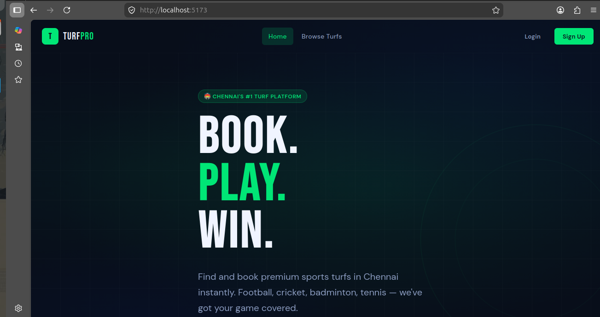
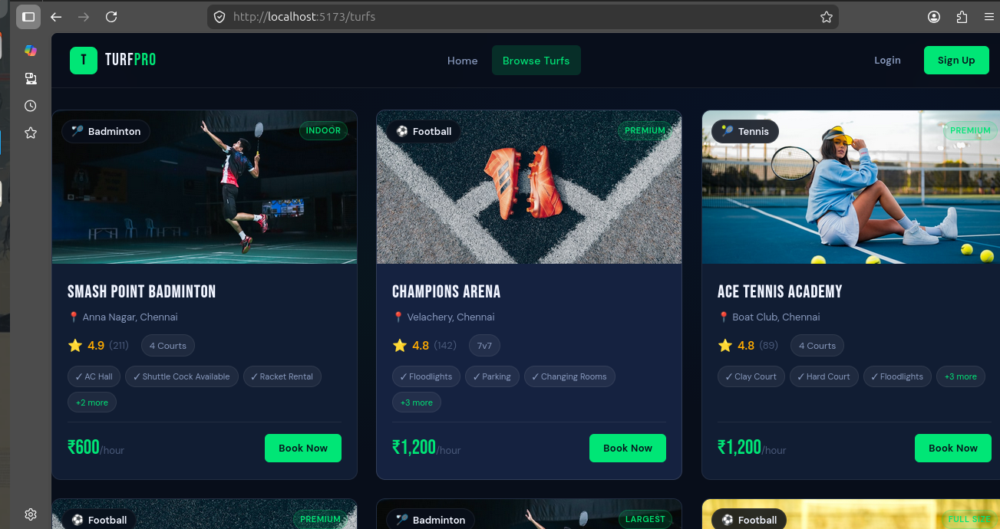
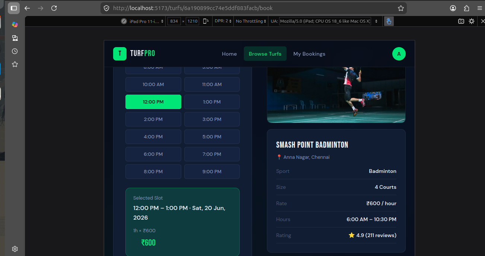
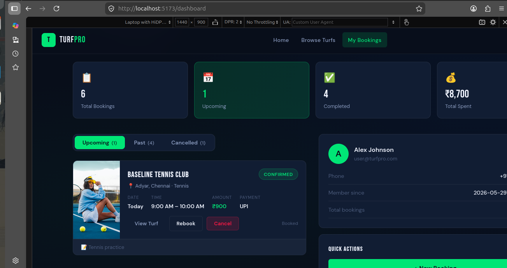
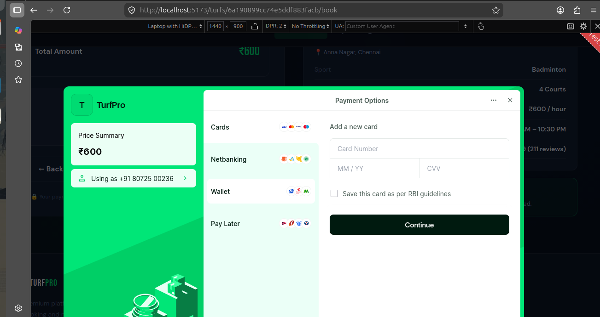
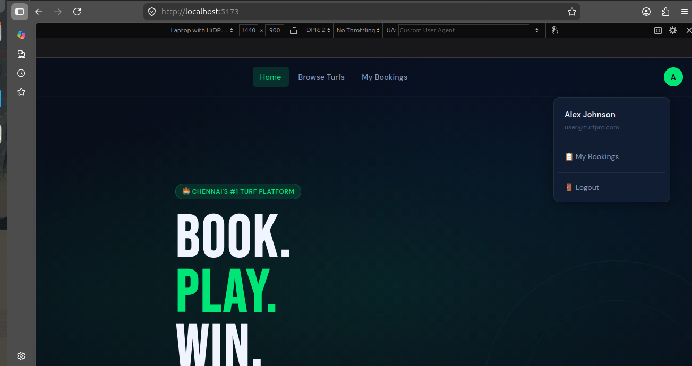
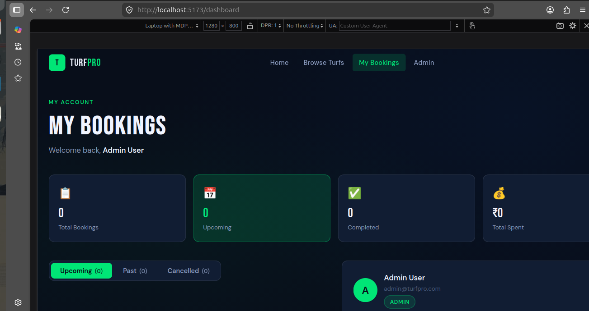

# 🏟️ TurfPro - Sports Turf Booking Platform

<p align="center">


</p>

<p align="center">
A modern full-stack sports turf booking system built with React, Node.js, Express, MongoDB, and Razorpay.
</p>

---

# 🚀 Live Demo

### Frontend

https://turfpro.vercel.app

### Backend API

https://turfpro-backend.onrender.com

---
# 👨‍💻 Project Team

### 🎯 Project Lead & Frontend Developer

**Mowriya M**

* Frontend Development (React.js)
* UI/UX Design
* Client-Side Integration
* Project Coordination

### ⚙️ Backend Developer

**Madhan Raj**

* GitHub: **madhann07**
* Node.js & Express.js Development
* REST API Development
* Authentication & Authorization

### 🗄️ Database Developer

**Dharun S**

* GitHub: **dharun1922006-cmd**
* MongoDB Database Design
* Mongoose Models
* Database Optimization & Management

---

## 🤝 Team Contributions

| Team Member | Responsibility                                  |
| ----------- | ----------------------------------------------- |
| Mowriya M   | Frontend Development, UI/UX Design, Integration |
| Madhan Raj  | Backend Development, APIs, Authentication       |
| Dharun S    | Database Design, MongoDB Management             |

---

### Built By

This project was collaboratively developed by:

* **Mowriya M** (Frontend & Project Lead)
* **Madhan Raj** (Backend Developer)
* **Dharun S** (Database Developer)

as part of a full-stack web development project using React, Node.js, Express.js, MongoDB, and Razorpay.


# 📖 Project Overview

TurfPro is a complete sports turf reservation platform that allows users to discover sports venues, check availability, book slots, and make secure online payments.

The platform also includes an admin dashboard for managing bookings, users, and turf listings.

---

# ✨ Key Highlights

✅ User Authentication & Authorization

✅ Sports Turf Discovery

✅ Smart Booking Workflow

✅ Razorpay Payment Integration

✅ Booking History Tracking

✅ Admin Management Dashboard

✅ RESTful API Architecture

✅ Responsive Design

✅ Mobile Friendly Interface

✅ Secure JWT Authentication

---

# 🏟️ Supported Sports

* Football
* Cricket
* Badminton
* Tennis
* Futsal
* Volleyball

---

# 🛠️ Tech Stack

## Frontend

* React.js
* Vite
* React Router DOM
* Axios
* Context API
* CSS Variables

## Backend

* Node.js
* Express.js
* JWT Authentication
* Razorpay API

## Database

* MongoDB
* Mongoose

## Deployment

* Vercel (Frontend)
* Render (Backend)
* MongoDB Atlas (Database)

---

# 📸 Project Screenshots

## Home Page



## Turf Listing



## Turf Details



## Booking Wizard



## Payment Page



## User Dashboard



## Admin Dashboard



---

# 📂 Project Structure

```text
TurfPro
│
├── frontend
│   ├── src
│   │   ├── assets
│   │   ├── components
│   │   ├── pages
│   │   ├── services
│   │   ├── context
│   │   ├── hooks
│   │   └── utils
│
├── backend
│   ├── src
│   │   ├── config
│   │   ├── controllers
│   │   ├── middleware
│   │   ├── models
│   │   ├── routes
│   │   └── utils
│
└── README.md
```

---

# 🔐 Authentication

Authentication is handled using JWT.

### Features

* User Registration
* User Login
* Protected Routes
* Role-Based Access
* Secure Password Hashing

---

# 💳 Payment Integration

Razorpay is integrated for secure online payments.

### Workflow

1. Select Turf
2. Select Date
3. Select Time Slot
4. Create Booking
5. Pay via Razorpay
6. Booking Confirmation

---

# 📡 API Documentation

## Authentication

### Register User

```http
POST /api/auth/register
```

Request

```json
{
  "name": "John Doe",
  "email": "john@example.com",
  "password": "password123"
}
```

### Login

```http
POST /api/auth/login
```

Request

```json
{
  "email": "john@example.com",
  "password": "password123"
}
```

---

## Turf APIs

### Get All Turfs

```http
GET /api/turfs
```

### Get Single Turf

```http
GET /api/turfs/:id
```

---

## Booking APIs

### Create Booking

```http
POST /api/bookings
```

### Get User Bookings

```http
GET /api/bookings/my-bookings
```

---

## Payment APIs

### Create Razorpay Order

```http
POST /api/payment/create-order
```

### Verify Payment

```http
POST /api/payment/verify
```

---

# ⚙️ Installation

## Clone Repository

```bash
git clone https://github.com/yourusername/turfpro.git
```

## Backend Setup

```bash
cd backend

npm install

npm run seed

npm run dev
```

## Frontend Setup

```bash
cd frontend

npm install

npm run dev
```

---

# 🔧 Environment Variables

## Backend

```env
PORT=5000

MONGO_URI=your_mongodb_uri

JWT_SECRET=your_secret

JWT_EXPIRE=7d

RAZORPAY_KEY_ID=your_key

RAZORPAY_KEY_SECRET=your_secret
```

## Frontend

```env
VITE_API_URL=http://localhost:5000/api
```

---

# 📱 Responsive Design

| Device  | Supported |
| ------- | --------- |
| Mobile  | ✅         |
| Tablet  | ✅         |
| Desktop | ✅         |

---

# 🔮 Future Enhancements

* AI Chat Support
* Email Notifications
* SMS Booking Alerts
* Turf Reviews & Ratings
* Live Availability Tracking
* Multi-Language Support
* Dark Mode
* Progressive Web App (PWA)

---

# 🤝 Contributing

Contributions are welcome.

Fork the repository and submit a pull request.

---

# ⭐ Support

If you like this project:

⭐ Star the repository

🍴 Fork the repository

📢 Share it with others

---

# 📜 License

This project is licensed under the MIT License.

---

<p align="center">
Made with ❤️ by Mowriya M
</p>
